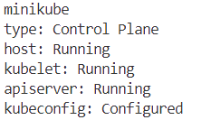
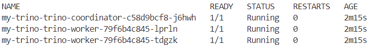
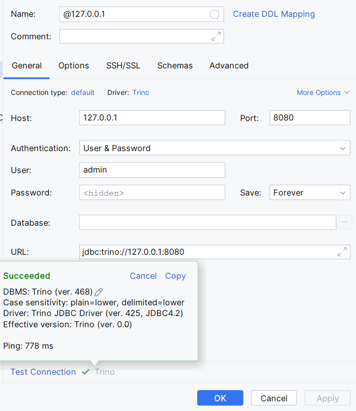

# Minio + Trino + Delta tables

## Quickstart

**Docker compose**

```
docker compose up
```

Use any compatible SQL client application that is listed in the [docs](https://trino.io/ecosystem/index.html)

**Example using DBeaver**

Add new source


Open SQL console


Run all queries


```sql
CREATE SCHEMA IF NOT EXISTS hive.iris
    WITH (location = 's3a://iris/');

CREATE TABLE IF NOT EXISTS hive.iris.iris_parquet
(
    sepal_length DOUBLE,
    sepal_width  DOUBLE,
    petal_length DOUBLE,
    petal_width  DOUBLE,
    class        VARCHAR
)
WITH (format = 'PARQUET');

INSERT INTO hive.iris.iris_parquet (select random() as sepal_length, random() as sepal_width, random() as petal_length, random() as petal_widths, cast(random(1, 3) as varchar) as class  from unnest(sequence(1,10)));

SELECT * FROM hive.iris.iris_parquet;
```

## Process

This guide outlines the process of designing and implementing a data lake architecture using the following components:

- Metastore: Hive Metastore
- SQL Engine: Trino
- Object Storage: MinIO
- Table Format: Delta Tables

The initial setup will use Docker Compose for local testing, with plans to migrate to Kubernetes for production deployment.

### Hive metastore

See [setup instructions](https://hive.apache.org/development/quickstart/#:~:text=%2D-,Metastore,-For%20a%20quick)


Original: 
```
docker run -d -p 9083:9083 --env SERVICE_NAME=metastore --env DB_DRIVER=postgres \
   --env SERVICE_OPTS="-Djavax.jdo.option.ConnectionDriverName=org.postgresql.Driver -Djavax.jdo.option.ConnectionURL=jdbc:postgresql://postgres:5432/metastore_db -Djavax.jdo.option.ConnectionUserName=hive -Djavax.jdo.option.ConnectionPassword=password" \
   --mount source=warehouse,target=/opt/hive/data/warehouse \
   --mount type=bind,source=`mvn help:evaluate -Dexpression=settings.localRepository -q -DforceStdout`/org/postgresql/postgresql/42.5.1/postgresql-42.5.1.jar,target=/opt/hive/lib/postgres.jar \
   --name metastore-standalone apache/hive:${HIVE_VERSION}
```

Modified:
 - use don't use `mvn` to find jar with Postgres driver
 - hardcode hive version
 - use `--network=host` to be able to reach the DB
 - add `pwd` to get absolute path to bind command
  
I manually downloaded: `postgresql-42.5.1.jar`

```
docker run -it -p 9083:9083 --env SERVICE_NAME=metastore --env DB_DRIVER=postgres --network host \
   --env SERVICE_OPTS="-Djavax.jdo.option.ConnectionDriverName=org.postgresql.Driver -Djavax.jdo.option.ConnectionURL=jdbc:postgresql://localhost:5432/metastore_db -Djavax.jdo.option.ConnectionUserName=hive -Djavax.jdo.option.ConnectionPassword=password" \
   --mount source=warehouse,target=/opt/hive/data/warehouse \
   --mount type=bind,source=`pwd`/postgresql-42.5.1.jar,target=/opt/hive/lib/postgres.jar \
   --name metastore-standalone apache/hive:4.0.0
```

Before we run it we need to create postgres instance:

```
docker run -it --rm \
  -e POSTGRES_USER=hive \
  -e POSTGRES_PASSWORD=password \
  -e POSTGRES_DB=metastore_db \
  -p 5432:5432 \
  postgres
```

```
docker run -it --rm \
  --name psql-client \
  --network host \
  postgres \
  psql -h localhost -U hive -d metastore_db
```

It seems to work as expected. Schema is initialized and no errors occurred.

Next step is to convert docker-run commands to `docker-compose.yaml`. Before we do that  let's customize the hive image so that we don't have to download the jar manually.
The file can be downloaded from the [maven repository](https://mvnrepository.com/artifact/org.postgresql/postgresql/42.5.1)

```Dockerfile
FROM apache/hive:4.0.0

ADD --chmod=644 https://repo1.maven.org/maven2/org/postgresql/postgresql/42.5.1/postgresql-42.5.1.jar /opt/hive/lib/postgres.jar
```

Now we can once again update the star-up command

```
docker run -it --rm -p 9083:9083 --env SERVICE_NAME=metastore --env DB_DRIVER=postgres --network host \
   --env SERVICE_OPTS="-Djavax.jdo.option.ConnectionDriverName=org.postgresql.Driver -Djavax.jdo.option.ConnectionURL=jdbc:postgresql://localhost:5432/metastore_db -Djavax.jdo.option.ConnectionUserName=hive -Djavax.jdo.option.ConnectionPassword=password" \
   --mount source=warehouse,target=/opt/hive/data/warehouse \
   --name metastore-standalone $(docker build -q .)
```

**Docker Compose**

Let's collect what we've done so far in a docker-compose file

```yaml
services:
  postgres:
    image: postgres
    environment:
      POSTGRES_USER: hive
      POSTGRES_PASSWORD: password
      POSTGRES_DB: metastore_db
    ports:
      - "5432:5432"
    networks:
      - metastore_network
    restart: unless-stopped

  hive-metastore:
    build: .
    hostname: metastore
    environment:
      SERVICE_NAME: metastore
      DB_DRIVER: postgres
      SERVICE_OPTS: |
        -Djavax.jdo.option.ConnectionDriverName=org.postgresql.Driver
        -Djavax.jdo.option.ConnectionURL=jdbc:postgresql://postgres:5432/metastore_db
        -Djavax.jdo.option.ConnectionUserName=hive
        -Djavax.jdo.option.ConnectionPassword=password
    ports:
      - "9083:9083"
    volumes:
      - warehouse:/opt/hive/data/warehouse
    networks:
      - metastore_network
    depends_on:
      - postgres
    restart: unless-stopped

networks:
  metastore_network:
    driver: bridge

volumes:
  warehouse:
    driver: local
```

**Minio**

In the final deployment on Kubernetes we will use an external Minio deployment that will be provided to us. 
For the testing purposes we want to have our own instance.

Based on [docs](https://min.io/docs/minio/container/index.html#procedure)

```
docker run \
   -p 9000:9000 \
   -p 9001:9001 \
   -v data:/data \
   -e "MINIO_ROOT_USER=user" \
   -e "MINIO_ROOT_PASSWORD=password" \
   quay.io/minio/minio server /data --console-address ":9001"
```

We can test it by visiting `http://127.0.0.1:9001/browser` and update `docker-compose.yaml`

```yaml
services:
  postgres:
    image: postgres
    environment:
      POSTGRES_USER: hive
      POSTGRES_PASSWORD: password
      POSTGRES_DB: metastore_db
    ports:
      - "5432:5432"
    networks:
      - metastore_network
    restart: unless-stopped

  metastore:
    build: .
    environment:
      SERVICE_NAME: metastore
      DB_DRIVER: postgres
      SERVICE_OPTS: |
        -Djavax.jdo.option.ConnectionDriverName=org.postgresql.Driver
        -Djavax.jdo.option.ConnectionURL=jdbc:postgresql://postgres:5432/metastore_db
        -Djavax.jdo.option.ConnectionUserName=hive
        -Djavax.jdo.option.ConnectionPassword=password
    ports:
      - "9083:9083"
    volumes:
      - metastore:/opt/hive/data/warehouse
    networks:
      - metastore_network
      - trino_network
    depends_on:
      - postgres
    restart: unless-stopped
  
  minio:
    image: 'quay.io/minio/minio:latest'
    environment:
      MINIO_ROOT_USER: user
      MINIO_ROOT_PASSWORD: password
    ports:
      - '9000:9000'
      - '9001:9001'
    volumes:
      - datalake:/data
    command: server /data --console-address ":9001"
    networks:
      - trino_network
    restart: unless-stopped

networks:
  metastore_network:
    driver: bridge

  trino_network:
    driver: bridge

volumes:
  metastore:
    driver: local

  datalake:
    driver: local
```

**Trino**

Reading list:
- Overview
  - [Use cases](https://trino.io/docs/current/overview/use-cases.html)
  - [Concepts https](trino.io/docs/current/overview/concepts.html)
- Connector related stuff
  - [Hive connector](https://trino.io/docs/current/connector/hive.html)
  - [Minio stuff](https://trino.io/docs/current/object-storage/file-system-s3.html)
- Deployment related stuff
  - [Node config][https://trino.io/docs/current/installation/deployment.html#]
  - [Docker deployment](https://trino.io/docs/current/installation/containers.html#)

Based on the documentation we need to create configuration files. We can use the default values for now.

Deployment config:
- `config.properties`
- `jvm.properties`
- `log.properties`
- `node.properties`

Data catalogs:
- `hive.properties`

Simplest start-up command
```
docker run --name trino -d -p 8080:8080 --volume $PWD/etc:/etc/trino trinodb/trino
```

As service in docker compose: 
```yaml
trino:
  image: trinodb/trino:latest
  ports:
    - "8080:8080"
  volumes:
    - ./trino:/etc/trino
  networks:
    - trino_network
  depends_on:
    - minio
    - hive-metastore
  restart: unless-stopped
```
For testing we can use any Trino client listed in the docs. I'm using executable JAR file with Trino CLI.

```
./trino.jar http://localhost:8080
```

For testing I will be using SQL queries from similar tutorial [link](https://fithis2001.medium.com/manipulating-delta-lake-tables-on-minio-with-trino-74b25f7ad479)


We can also automate it for future deployments by adding `minio/mc` util to the `docker-compose.yaml` file.

```yaml
  mc:
    depends_on:
      - minio
    image: minio/mc
    container_name: mc
    entrypoint: >
      /bin/sh -c "
      until (/usr/bin/mc config host add minio http://minio:9000 user password) do echo '...waiting...' && sleep 1; done;
      /usr/bin/mc rm -r --force minio/iris;
      /usr/bin/mc mb minio/iris;
      /usr/bin/mc policy set public minio/iris;
      exit 0;
      "
    networks:
      - trino_network
```

```sql
CREATE SCHEMA IF NOT EXISTS hive.iris
    WITH (location = 's3a://iris/');

CREATE TABLE IF NOT EXISTS hive.iris.iris_parquet
(
    sepal_length DOUBLE,
    sepal_width  DOUBLE,
    petal_length DOUBLE,
    petal_width  DOUBLE,
    class        VARCHAR
)
WITH (format = 'PARQUET');

INSERT INTO hive.iris.iris_parquet (select random() as sepal_length, random() as sepal_width, random() as petal_length, random() as petal_widths, cast(random(1, 3) as varchar) as class  from unnest(sequence(1,10)));

SELECT * FROM hive.iris.iris_parquet;
```


When attempting to create schema we get a dependency error. 


The error is displayed in the Trino's console but after some research I found out it's actually hive related.

The resolution is to add S3 drivers to the metastore image.

```Dockerfile
FROM apache/hive:4.0.0

# Postgres Driver
ADD --chmod=644 https://repo1.maven.org/maven2/org/postgresql/postgresql/42.5.1/postgresql-42.5.1.jar /opt/hive/lib/postgres.jar

# S3 Drivers
ADD --chmod=644 https://repo1.maven.org/maven2/com/amazonaws/aws-java-sdk-bundle/1.11.1026/aws-java-sdk-bundle-1.11.1026.jar /opt/hive/lib/aws-java-sdk-bundle-1.11.1026.jar
ADD --chmod=644 https://repo1.maven.org/maven2/org/apache/hadoop/hadoop-aws/3.3.2/hadoop-aws-3.3.2.jar /opt/hive/lib/hadoop-aws-3.3.2.jar
```

Now we get missing credentials error. Again it's hive related and we need to create `core-site.xml` with minio credentials and mount it in `/opt/hadoop/etc/hadoop/core-site.xml`


### Testing

For testing you can use any client application listed on the Trino's website.

Example configuration for DBeaver


## Helm Chart Configuration for Trino Using Minikube

This section describes the steps to deploy Trino using Helm and Minikube, while connecting it to services like Postgres, Minio, and Hive Metastore running in Docker Compose.

### Prerequisites
1. Install [Minikube](https://minikube.sigs.k8s.io/docs/start/?arch=%2Fwindows%2Fx86-64%2Fstable%2F.exe+download). Minikube allows you to run Kubernetes locally.
2. Install [Helm](https://helm.sh/docs/intro/install/). Helm is a package manager for Kubernetes, used to deploy applications via "charts."
3. Verify the installations by checking their versions:
   ```bash
   minikube version
   helm version
   ```
### Helm Chart Configuration
This project uses a custom Helm chart for Trino, based on the official Trino Helm chart.

> **Note**: The `trino-custom` folder with pre-configured `values.yaml` and `Chart.yaml` files is included in this project. This section explains how the configuration was created for reference only.

**Chart.yaml**:   
Defines the dependencies and metadata for the Helm chart. Specifies Trino as a dependency, using the official Helm chart as the base.

```yaml
dependencies:
- name: trino
  version: 1.35.0
  repository: https://trinodb.github.io/charts/
```

**values.yaml**   
Overrides default configurations, customizing catalogs for this setup.

```yaml
catalogs:
  delta: |-
    connector.name=delta_lake
    hive.metastore=thrift
    hive.metastore.uri=thrift://host.minikube.internal:9083
    fs.native-s3.enabled=true
    s3.path-style-access=true
    s3.endpoint=http://host.minikube.internal:9000
    s3.aws-access-key=user
    s3.aws-secret-key=password
    s3.region=us-east-1

  hive: |-
    connector.name=hive
    hive.metastore.uri=thrift://host.minikube.internal:9083
    fs.native-s3.enabled=true
    s3.path-style-access=true
    s3.endpoint=http://host.minikube.internal:9000
    s3.aws-access-key=user
    s3.aws-secret-key=password
    s3.region=us-east-1
    hive.non-managed-table-writes-enabled=true
```
- Configures catalogs for Delta Lake and Hive.
- `host.minikube.internal`: Allows services in Minikube to communicate with those in Docker Compose.
- Postgres is not directly referenced in Trino because it serves as the backend for Hive Metastore and not Trino itself.

#### Sequence of Steps

1. Add the Trino repository and update dependencies:

```bash
helm repo add trino https://trinodb.github.io/charts/
helm repo update
```

2. Create a custom Helm chart for Trino:

```bash
helm create trino-custom
```

3. Modify `Chart.yaml` to include the Trino dependency.

4. Update Helm dependencies:

```bash
helm dependency update
```

5. Update `values.yaml` to include custom configurations for catalogs.

6. Install Trino using the customized `values.yaml` file:

```bash
helm install my-trino trino/trino -f values.yaml
```

### Deployment steps

1. **Start Docker Compose Services**  
   Start the services required for Trino integration (Postgres, Minio, Hive Metastore):

   ```bash
   docker compose up postgres minio hive-metastore
   ```

2. **Start Minikube**  
    Ensure that Docker Desktop is running and launch Minikube with sufficient resource allocations:

    ```bash
    minikube start --memory=6g --cpus=3 --driver=docker
    ```
  - `memory=6g`: Allocates 6GB of memory.
  - `cpus=3`: Allocates 3 CPU cores.
  - `driver=docker`: Uses Docker as the virtualization driver.

3. **Check Minikube Status**  
    Verify that Minikube is running:

    ```bash
    minikube status
    ```

    The result should look as follows:   

    

4. **Add Helm Chart Repository**  
    Add the Trino Helm chart repository and update:

    ```bash
    helm repo add trino https://trinodb.github.io/charts/
    helm repo update
    ```

    This step ensures that Helm has access to the latest Trino charts, which are required to deploy Trino properly.

5. **Deploy Trino Using Helm**   
    Navigate to the `trino-custom` directory where the `values.yaml` file is located and deploy the Trino Helm chart:

    ```bash
    helm install my-trino trino/trino -f values.yaml
    ```

6. **Check Pod Status**   
    Confirm that all Trino pods (coordinator and workers) are in the `READY` state. Note that this process may take a few minutes:

    ```bash
    kubectl get pods
    ```

    The result should look as follows:   

    

7. **Forward Ports**   
    Forward the Trino service port to access the Trino Web UI locally:

    ```bash
    kubectl port-forward svc/my-trino-trino 8080:80
    ```

    This is necessary because Trino is running inside Minikube, and port forwarding allows local access to the Trino Web UI.

8. **Access the Trino Web UI**  
    Open your browser and go to `http://127.0.0.1:8080`.


9. **Connect to Trino Using SQL Client**   
    Use a SQL client application (e.g., DataGrip) to connect to Trino for querying.

    


10. **Test Table Creation**   
    Create tables in Trino and verify their presence in Minio (S3-compatible storage) to ensure the setup works as expected.

    ```sql
    CREATE SCHEMA IF NOT EXISTS delta.iris
    WITH (location = 's3a://iris/');

    CREATE TABLE delta.iris.minikube_test (
        id INT,
        name VARCHAR,
        age INT
    )
    WITH (location = 's3a://iris/minikube_test/');

    INSERT INTO delta.iris.minikube_test (id, name, age) VALUES
        (1, 'Alice', 30),
        (2, 'Bob', 25);

    SELECT * FROM delta.iris.minikube_test;
    ```

11. **Access Minio**   
    Open your browser and navigate to the Minio Console `http://localhost:9001` to verify that the Delta table has been created successfully.
